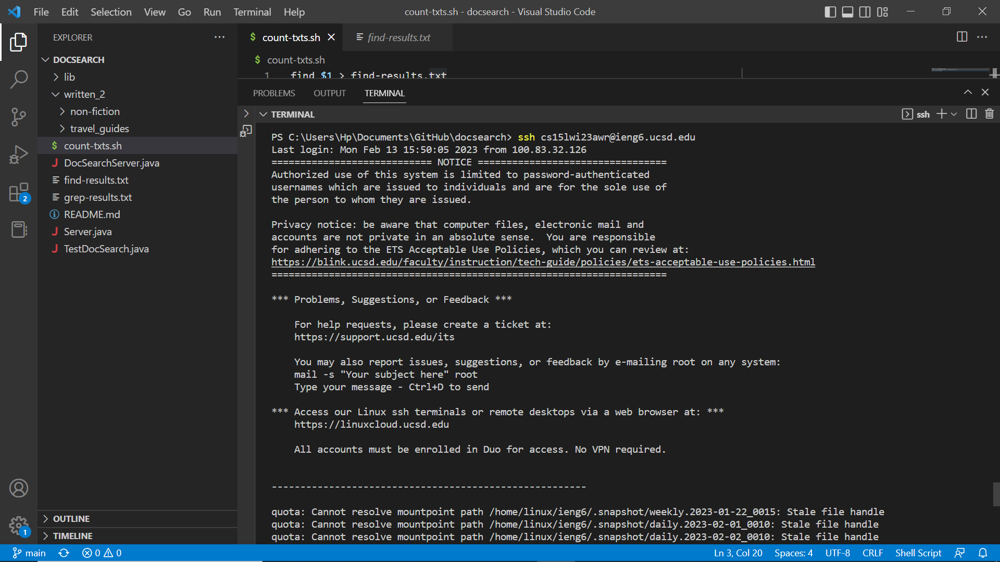

# Lab Report 4
The topic for this lab report will cover steps 4 to 9 from lab 7. To help you better understand the steps I will include screenshots as well.
## Step 4: Log in to ieng6
Keys Pressed: <up><enter>
The line with my ssh and my ieng6 remote account username was one line above so I went one up and pressed enter. As I had set up the SSh key I did not have to input my password. 

## Step 5: Clone your fork of the repository from your Github account

