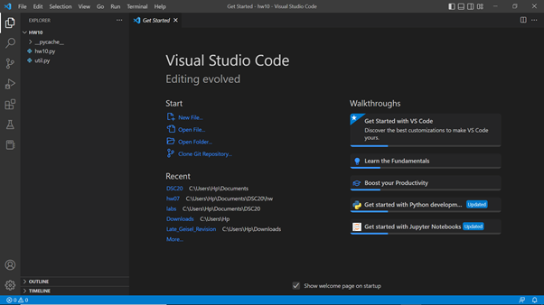
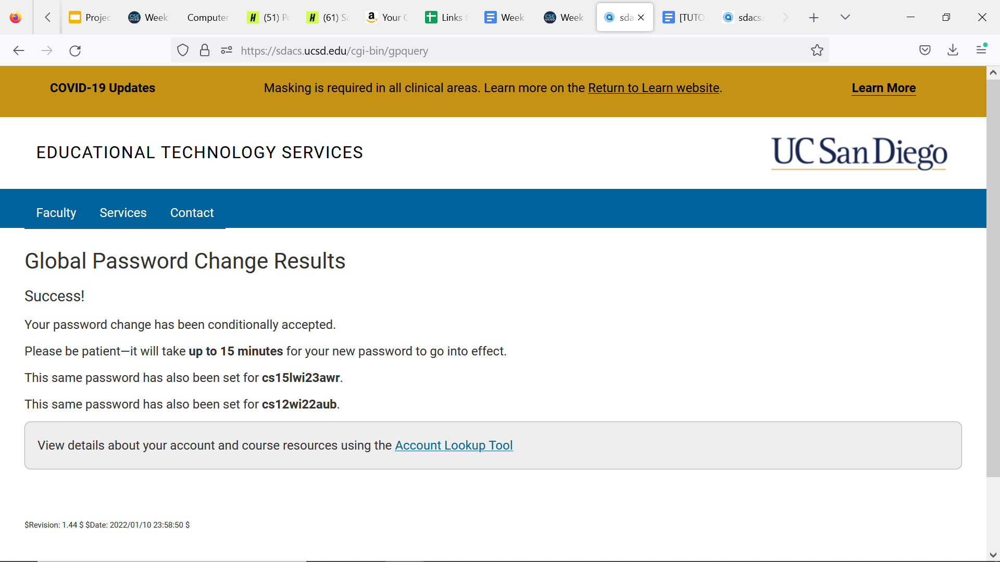
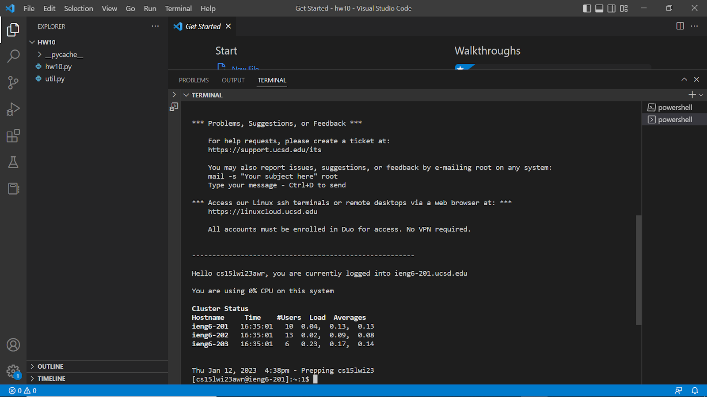
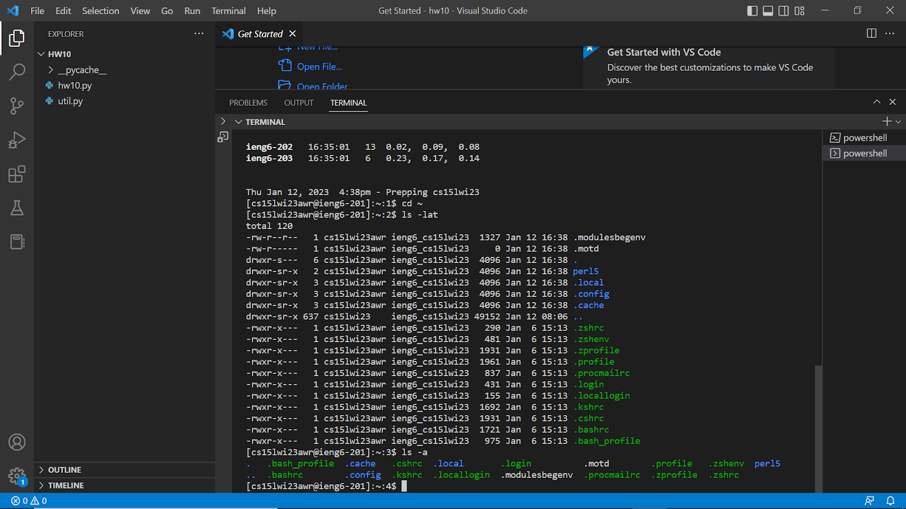

# Lab Report 1
The topic for this lab report will be remote access. I teach you how to complete each step as well as tell you about my experience at each step. To help you better understand the steps I will include screenshots as well.
___
## Step 1: Installing VSCode
You should go to the website [VSCode download link](https://code.visualstudio.com/) and download the software. After downloading it, you should set it up to the default settings. I had already downloaded the editor so I did not have to do it again. When it has finished downlaoding, you should open it and it should look like this. 
## Step 2: Remotely Connecting 
To remotely connect you must first learn the username of your account. To do so please visit this . Then change the password using the forget password link in the page. Do not change the password of your TritonLink account as well. After you have changed the password the website should look like this.  
While you wait for the password to be updated, download git for windows using this [link](https://gitforwindows.org/) and set it up. After you are done with that, open VSCode. Open a new terminal and type the following code, "$ ssh abc@ieng6.ucsd.edu" and type your username instead of abc. You should see a message on your screen asking you to confirm if that is the server that you want to connect to, type 'yes'. Then type in your password. One thing to remember is thatt it does not show you the password and the cursor does not move at all so you will be typing in your password but you would not know it. I made this mistake more than once while doing this. Once you have successfully logged in, your screen should look like this. 
## Step 3: Trying Some Commands
Now that you have successfully signed in to your account, you can try a few basic commands. Try running the same commands on your local computer and the remote computer and notice the difference. Some basic commands you might want to try could be "cd ~", 'ls -lat', and 'ls -a'. Your output should look something like this 
After you are done you can use the 'exit' command to log out of the remote server. 

Hope you understood everything in this blog post!
