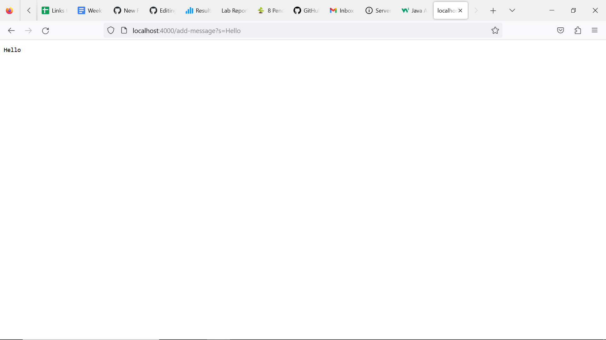
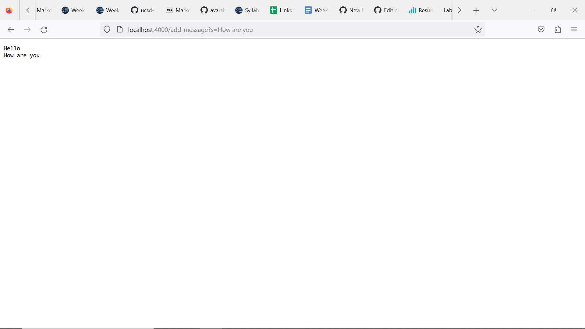
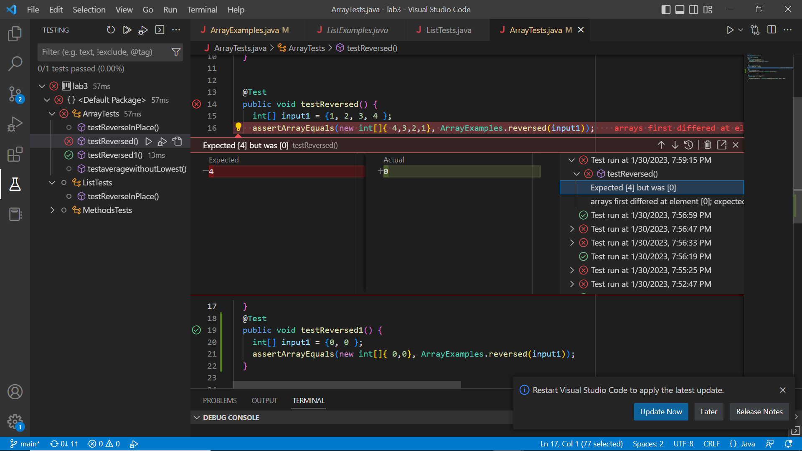
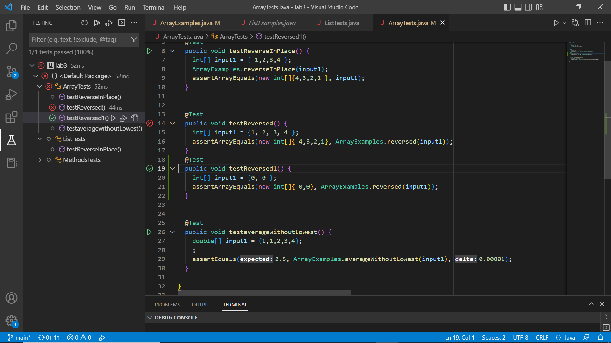

# Lab Report 2
The topic for this lab report will cover servers and bugs. I teach you how to complete each step as well as tell you about my experience at each step. To help you better understand the steps I will include screenshots as well.

## Part 1: Creating Your Web Server
To create your own basic server, first you must fork [this](https://github.com/ucsd-cse15l-f22/wavelet) repository and open it in VS Code. Then open the NumberServer.java file, make the changes in the handler class as shown below and rename the file to StringServer.java. 

    class Handler implements URLHandler {
    // The one bit of state on the server: a number that will be manipulated by
    // various requests.
    int num = 0;
    String s = "";

    public String handleRequest(URI url) {
        if (url.getPath().equals("/")) {
            return s;
        } 
         else {
            System.out.println("Path: " + url.getPath());
            if (url.getPath().contains("add-message")) {
                String[] parameters = url.getQuery().split("=");
                if (parameters[0].equals("s")) {
                    s += parameters[1]+'\n';
                    return s;
                }
            }
            return "404 Not Found!";
        }
    }

After you have made the changes complie and run the two files. If you have done so correctly then you will see a link to a local host page, click it. To add a string to the server, the form of the URL should be '/add-message?s='. I have shown an example below.  
As you can see, I wrote '/add-message?s=Hello' after the host URL and Hello was shown on my server page. Here, the handler method is called which reads the whole URI as an arguement. Then, if there is no arguemnt ahead of the backslash, it returns the empty s string. In our case however, there is an arguement after the backslash so, it goes to the first if statemtn which sees that the URI arguement as a whole contains "add-message". Then an array called paramenters is created wherein the URI is split in  2 parts, one ahead and one behind of the equal to sign. The next if statement checks if the first element in the parameters array is "s". If it is "s" then it concatenates the second element of the array to the string along with creating a new line and returns the string. I have another example for you as well. 
Over here, you can see the line "How are you" being added under hello. The same process happens as the first time. However, this time in the second if statement in the else statment, the second element in the parameter array is "How are you" and it gets concatenated to String s which already has "Hello" stored in it. 
## Part 2: Bugs
In week three of my CSE 15L lab, I created this test which failed for the reversed method. 

    public void testReverseInPlace() {
        int[] input1 = { 1,2,3,4 };
        ArrayExamples.reverseInPlace(input1);
        assertArrayEquals(new int[]{4,3,2,1 }, input1);
    }

However, when I would try the test below it would pass.

    @Test
    public void testReversed1() {
        int[] input1 = {0, 0 };
        assertArrayEquals(new int[]{ 0,0}, ArrayExamples.reversed(input1));
    }

Here are the outputs of the two tests shown.

Here is the old code.

    static int[] reversed(int[] arr) {
        int[] newArray = new int[arr.length];
        for(int i = 0; i < arr.length; i += 1) {
            arr[i] = newArray[arr.length - i - 1];
    }
    return arr;
    }
    
  
  Here is my debugged version of the code.
  
  
  
    static int[] reversed(int[] arr) {
        int[] newArray = new int[arr.length];
  
    
        for(int i = 0; i < arr.length; i += 1) {
            newArray[arr.length - i-1] = arr[i];
        }
    return newArray;
    }
  
 
  
  I just had to change one line as initially, the elements of arr were being overwritten by the empty array of newArray, in reverse order. When I flipped this line, the elements of the original arr were being copied in reverse order into the NewArray. 
## Part 3: My Learning
During my last lab, I learnt the importance of creating the right tests as some tests with basic values might pass however there may be an issue dealing with the edge cases and dealing with invalid inputs. During the lab, I learnt about the many different types of bugs which can affect my code and the common types of test cases I should run to ensure that I write robust code. 

Thank you for reading my blog post. 
  
