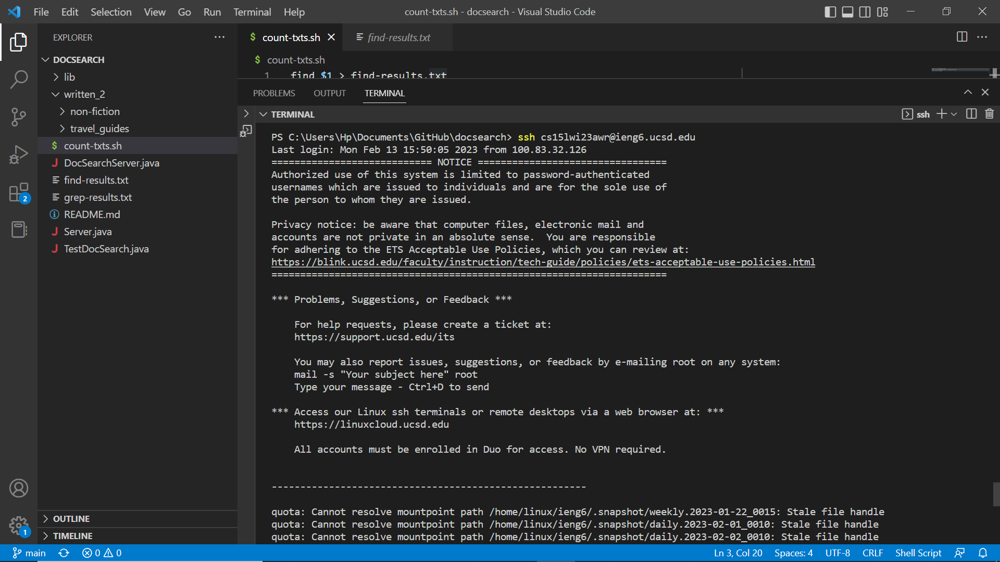
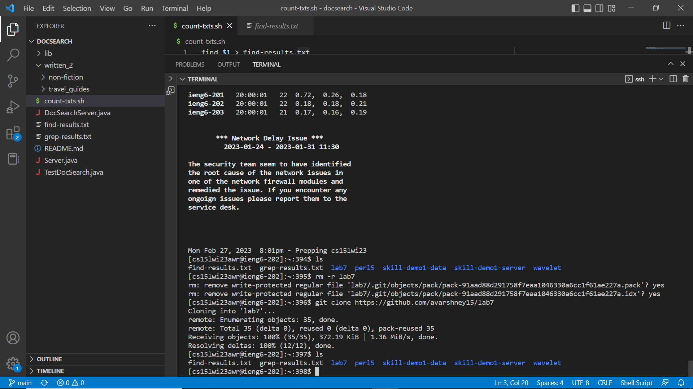
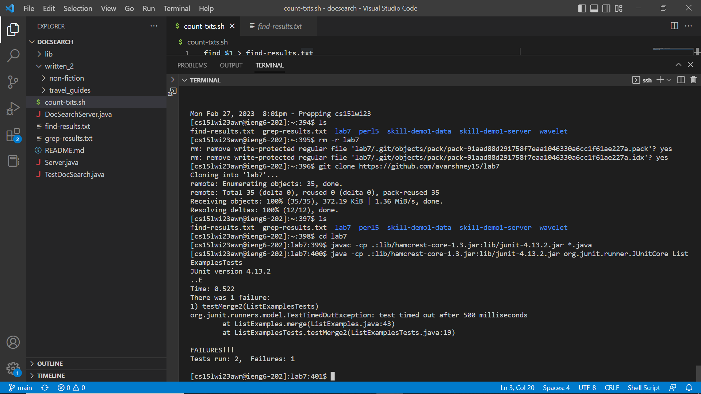
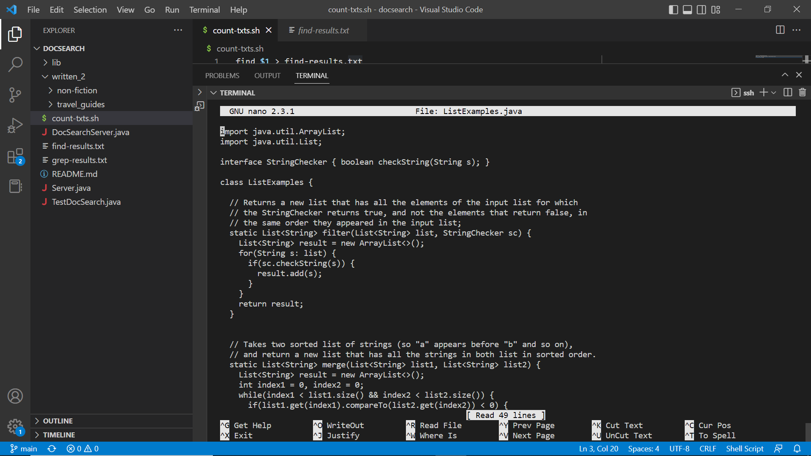
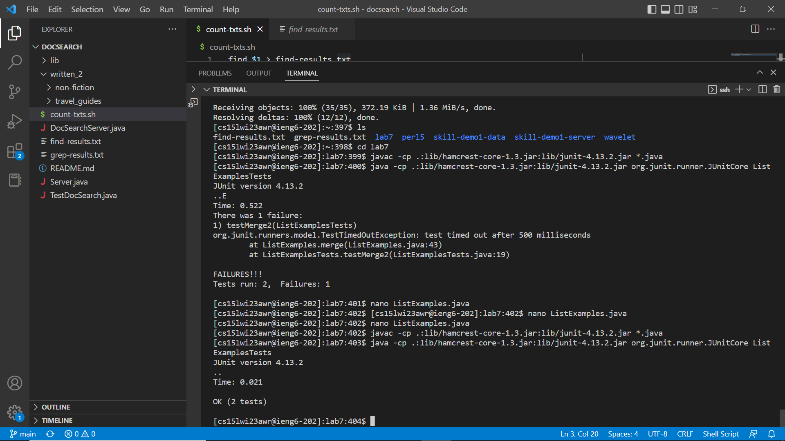
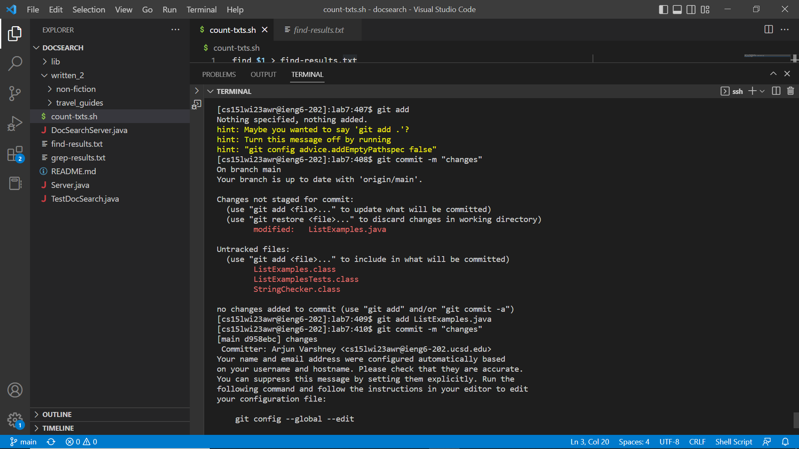

# Lab Report 4
The topic for this lab report will cover steps 4 to 9 from lab 7. To help you better understand the steps I will include screenshots as well.
## Step 4: Log in to ieng6
Keys Pressed: ```<up><enter>```
The line with my ssh and my ieng6 remote account username was one line above so I went one up and pressed enter. As I had set up the SSH key I did not have to input my password. 

## Step 5: Clone your fork of the repository from your Github account
Keys Pressed: ```<up><up><up><up><up><up><up><up><up><up><up><up><up><enter>```
The line with the command for cloning the lab 7 repository from git hub, git clone https://github.com/avarshney15/lab7, was 13 lines up so I went up and pressed enter. This created a clone of the git repository in my ieng6 account. 

## Step 6: Run the tests, demonstrating that they fail
Keys Pressed: ```<c><d>< ><l><a><b><7>, <up><up><up><up><up><up><up><up><up><Enter>```
I first used th cd command to enter the new lab 7 directory. Then I went 9 commands up to find the, javac -cp .:lib/hamcrest-core-1.3.jar:lib/junit-4.13.2.jar *.java, command which compiles all of the java files in the folder. Then I went 9 commands up to get the  java -cp .:lib/hamcrest-core-1.3.jar:lib/junit-4.13.2.jar org.junit.runner.JUnitCore ListExamplesTests command and pressed enter which runs the ListExamplesTests class and outputs the result. As you can see, the tests are failing right now. 

## Step 7: Edit the code file to fix the failing test
Keys Pressed: typed "nano ListExamples.java",``` <control><X><Y> ```
  This opened the ListExamples.java fiel inside the nano editor in the terminal. Then I fixed the errors in the first method by changing the result.add(0,s) line to result.add(s) as the method is supposed to add the string to the end of the result list not to the beginning. Then I went to the next method and changed the condition in the third while loop as the increment should be to index 2 if the size of the second list is greater than the index of the second list. Then I pressed control and X to exit the file. There it asked me if I wanted to save it and I pressed "Y" for yes. 
## Step 8: Run the tests, demonstrating that they now succeed
Keys Pressed: ```<up><up><up><enter>,<up><up><up><enter>```
I pressed up thrice to get the javac -cp .:lib/hamcrest-core-1.3.jar:lib/junit-4.13.2.jar *.java, again to compile all of the java files. I pressed up thrice again to get the java -cp .:lib/hamcrest-core-1.3.jar:lib/junit-4.13.2.jar org.junit.runner.JUnitCore ListExamplesTests command which runs the ListExamplesTests and as you can see all of the tests have passed. 
## Step 9: Commit and push the resulting change to your Github account
 Keys Pressed: typed "git add ListExamples.java", ```<up><up><up><up><up><up><up><up><up><up><up><up><Enter>, <up><up><up><up><up><up><up><up><up><up><up><up><Enter>```
 I first typed git add ListExamples.java to add the changes made in the java file to the working directory. I pressed up 12 times to find the git commit -m "changes" command which commits the changes made locally and gives it a description. Then I went up 12 times again to get the git push command which sends the changes to the remote repository. 
 
  

Hope you understood everything in this blog post!
  

